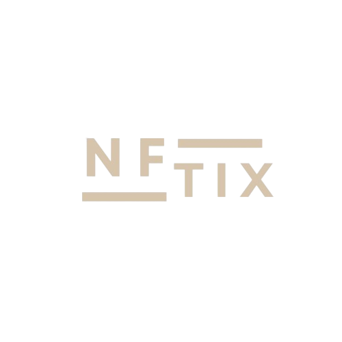
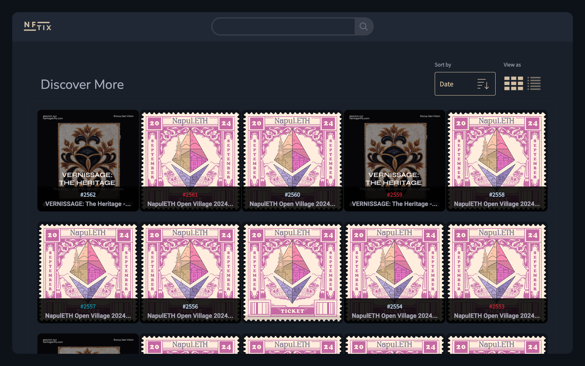
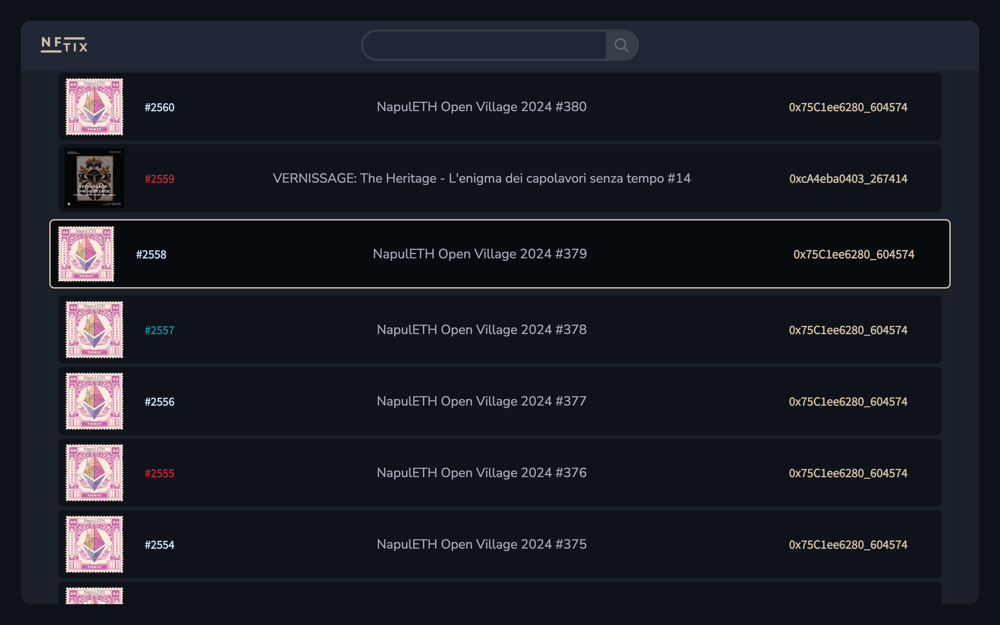
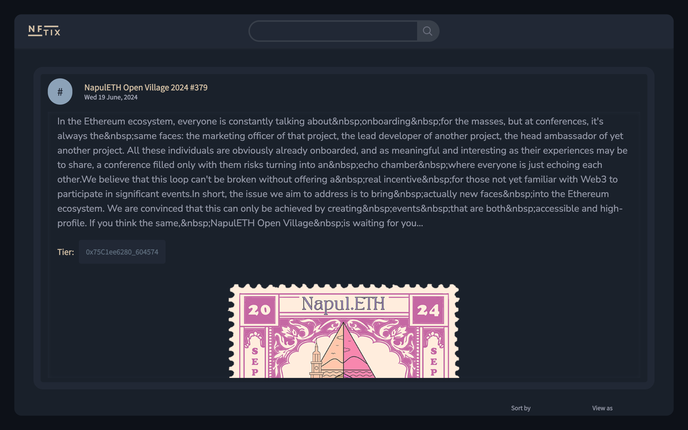
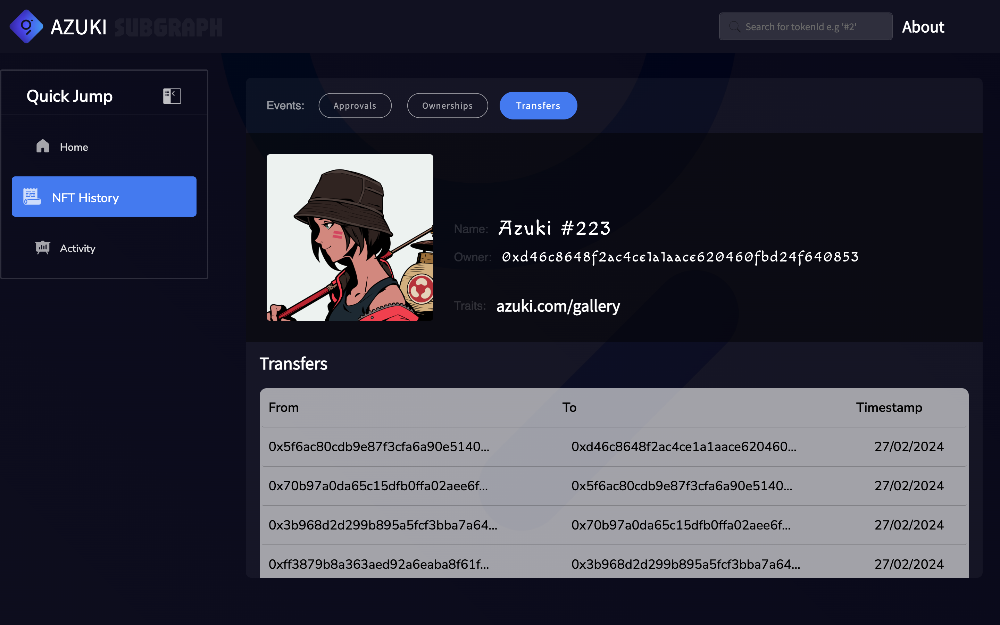
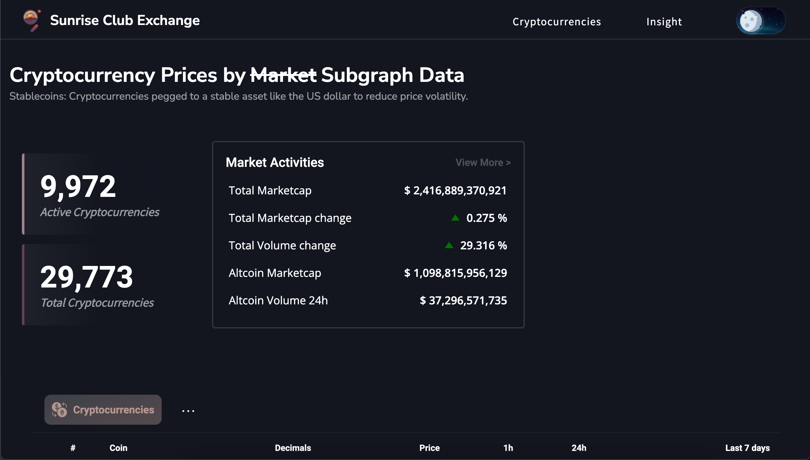
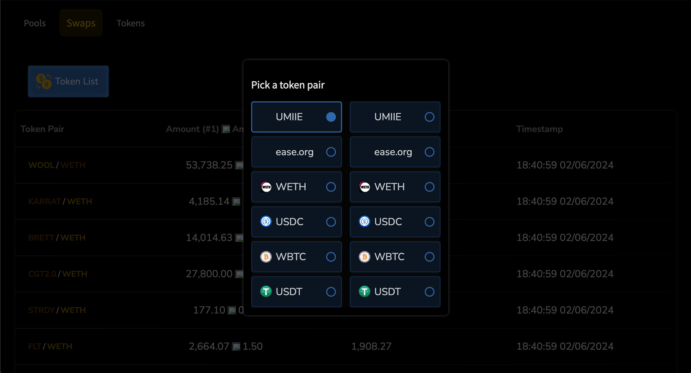
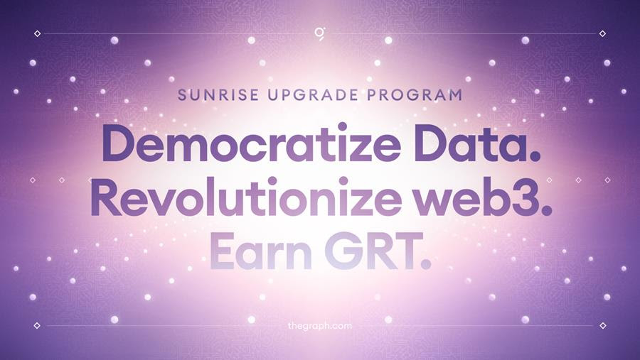

<div align="center">
    
    <h1>The Final Wave of Missions 🌅</h1>
</div>

### Description

A portal where users can effortlessly search and discover their MEGO NFT tickets. This dapp leverages the MEGO subgraph, acting as a window into the rich data behind those tickets. With a few clicks, users can find their specific event based on _Tier_, _Token ID_, e.t.c, instantly pulling up all their relevant MEGO NFTs. No more digging into blockchain explorer and getting lost – just a seamless experience powered by The Graph!

### Table of Contents

- [Description](#description)
- [Getting Started](#getting-started)
- [Learn More](#learn-more)
- [Inside the DApp](#inside-the-dapp)
- [Final Remark](#final-remark)

## Getting Started

First, run the development server:

```bash
npm run dev
# or
yarn dev
# or
pnpm dev
# or
bun dev
```

Open [http://localhost:3000](http://localhost:3000) with your browser to see the result.

You can start editing the page by modifying `app/page.tsx`. The page auto-updates as you edit the file.

## Learn More

#### To learn more about Next.js, take a look at the following resources:

- [Next.js Documentation](https://nextjs.org/docs) - learn about Next.js features and API.
- [Learn Next.js](https://nextjs.org/learn) - an interactive Next.js tutorial.

You can check out [the Next.js GitHub repository](https://github.com/vercel/next.js/) - your feedback and contributions are welcome!

#### To learn more about The Graph, take a look at the following resources:

- [The Graph Documentation](https://thegraph.com/docs/en/) - Learn about The Graph, a decentralized protocol for indexing and querying data from blockchains.

## Inside the DApp

<div align="center">
    
    
    <br/>
    
</div>

## Previous Missions

<div align="center">
    <a href="https://github.com/E-Zbox/azuki-subgraph-dapp" _target="blank"></a>
    <p><i>MISSION ONE</i> - <b>AZUKI</b></p>
    <br/>
</div>

<div align="center">
    <a href="https://github.com/E-Zbox/sunrise-exchange-club-dapp" _target="blank"></a>
    <p><i>MISSION TWO</i> - <b>Sunrise Exchange Club</b></p>
    <br/>
</div>

<div align="center">
    <a href="https://github.com/E-Zbox/liquidity-lens-dapp" _target="blank"></a>
    <p><i>MISSION FOUR</i> - <b>Liquidity Lens</b></p>
    <br/>
</div>

## Final Remark

Had a ton of fun building and integrating various subgraphs showing the seamless process of getting blockchain data using The Graph - blockchain data indexing protocol.

<div align="center">
    
    <p>
        This marks the end of <b>The Graph's SUNRISE UPGRADE PROGRAM</b>
    </p>
    <h3>Cheers to The Graph! Cheers to Web3 🥂</h3>
</div>
